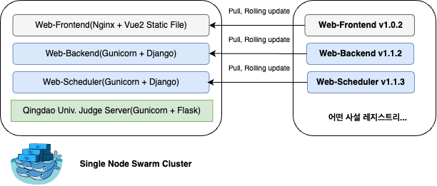

# 사설 레지스트리를 구축한 이유

## 서론

***

2024년 8월 26일자로, 내가 팀원 두 명과 8개월간 끙끙거리면서 만든 서비스를 출시하였다.\
\
아래는 자랑스러운 내 아들같은 서비스이다.

~~아직 버그는 좀 있지만...~~


부산대학교 온라인 저지 서비스, 코드플레이스


현재 우리 팀은 **모노레포**를 사용 중이며, 주요 컴포넌트는 아래와 같다.&#x20;

<figure><figcaption>
모노레포 주요 컴포넌트
</figcaption></figure>

채점 서버는 칭다오 대학의 오픈소스 채점서버를 가져와서 사용하고, \
나머지는 프론트엔드 어플리케이션 하나, 백엔드 어플리케이션 두 개, 그리고 DB로 구성되어있다.

위에 보이는 Web-Scheduler 서버는 APScheduler가 작동하며,\
주기적으로 실행되야 하는 작업(ex. 주마다 보너스 문제 선별, 어려운 문제 선별 등)을 실행하며 업데이트가 잦을 만한 서비스는 아니었다..

따라서 이 각 컴포넌트들은 도커 컨테이너로 실행되지만, \
막상 업데이트가 잦은  도커 이미지는 결국 Web-Frontend, Web-Backend 이 두 가지 밖에 없었다.

## 본론

***

모노레포이지만 각각 컴포넌트를 버저닝을 따로하여 각각의 패치노트를 작성하는 것이 좋다고 느껴졌다.

또한 운영 중인 서비스의 도커 이미지를 Docker Hub와 같은 Public한 공간에 올려둘 수는 없었고,&#x20;

무엇보다 Docker Hub에서는 Private repository를 하나만 무료로 지원했다.

따라서 나중에 어플리케이션이나 컴포넌트가 확장될 것과 현재 온프레미스 서비스를 하고 있는 것을 생각하면,

비용적으로나 보안적으로나 Private Registry를 구축하여 버전 관리를 하는게 낫다는 판단이 들었다.

<figure><figcaption>
이런 식으로 컴포넌트별 버저닝과 롤링업데이트를 꿈꿨다
</figcaption></figure>

### 왜 Harbor를 선택했는지.

일단 당장 뭐가 필요했는지 솔직 담백하게 생각해보았다.

1. 우리 팀이 만든 도커 이미지를 도커 허브 상에서 관리하자니, 보안적으로도 걱정이 되고, 여러 개의 프라이빗 레포를 사용하지 못함.
2. 교내에 존재하는 온프레미스 서버를 사용하기에, 교내 보안 규정에 알맞게 바꾸면서 사용할 레지스트리가 필요
3. 기본적인 인증, 인가 필요
4. 웹 GUI 필요(중요)
5. Docker Registry API 기능을 온전히 활용할 수 있어야 함
6. 레지스트리가 컨테이너 기반으로 동작했으면 좋겠다...

이렇게 네 가지 이유가 있었다.&#x20;

그래서 일단 무작정 CNCF의 [Cloud Native Landscape](https://landscape.cncf.io/) 사이트를 들어가보았다.

<figure><figcaption></figcaption></figure>

아 그렇구나. 컨테이너 레지스트리로는 Harbor가 유일하게 Graduate 상태였다.\
그래서 Harbor의 여러 기능들을 살펴보니 당연히 내가 사용하려고하는 기능 이상으로 성숙된 프로젝트였다.

그래서 일단 설치해보고 생각하기로 했다.
