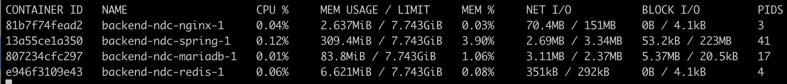
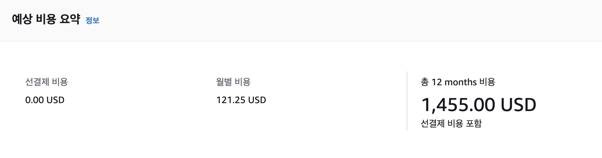
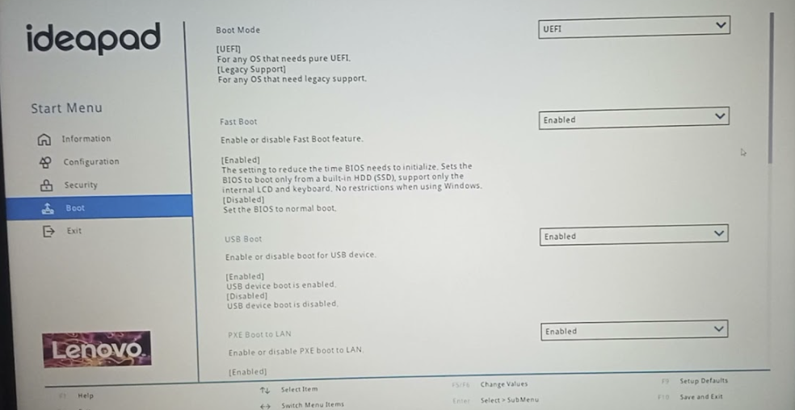
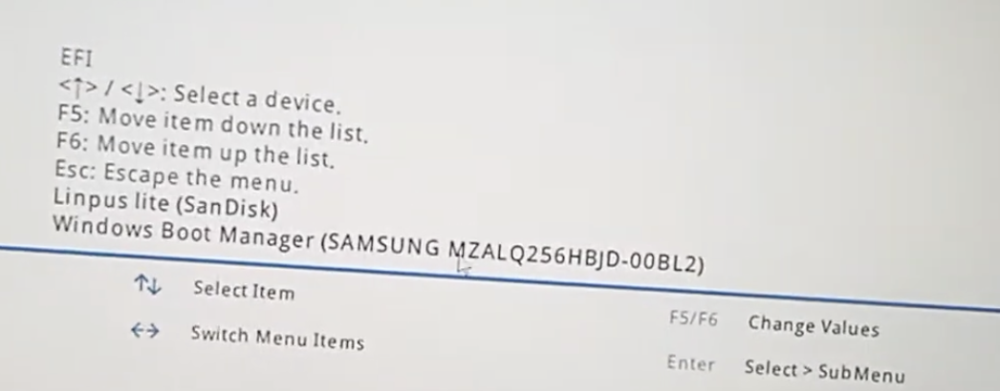

# \[자취방 클라우드] 노트북으로 리눅스 서버 구축하기

## 서론 

***

4학년이 되면서, 웹 서비스를 만들 일이 많아졌고, 지금까지는 azure 교육 요금제 또는 AWS 프리티어를 이용해서 호스팅을 하고 있었다.

나는 백엔드 개발자를 지망하기 때문에

각종 WAS(Spring boot, Django) 및 DB(MariaDB, PostgreSQL)와 웹서버를 Docker compose로 패키징하여 배포하는 일이 많았다.

하지만 azure나 aws를 사용하면서 느낀 점은,

교육 요금제나 프리티어를 이용해서 무료로 사용할 수 있는 사양 한도는 보통 **논리 CPU 1개 \~ 2개, 메모리 1GB \~ 4GB 정도**의 수준으로 사용할 수 밖에 없었다.

Spring boot에 로그인 기능과 회원가입 기능정도만 추가하여 Dockerize하여 컨테이너로 실행을 했을 때,

<figure><figcaption>
Docker Stats
</figcaption></figure>

위 이미지처럼 기본적으로 300MB 이상의 메모리를 사용 중인 것을 볼 수 있고 퍼블릭 클라우드의 무료 요금제로는 턱없이 부족하다는 생각이 들었다.

내가 가지고 있는 노트북은 CPU 8코어, RAM 16GB/Storage 512GB로

azure나 aws를 이정도 사양을 이용하려면 월 121달러를 지불해야 한다는 계산이 나온다.

<figure><figcaption>
AWS EC2( c5.2xlarge )
</figcaption></figure>

물론 기본 사양 외에 AWS에서 제공하는 네트워크 사양은 자취방 네트워크 사양보다 월등하지만 **네트워크 속도를 조금 포기**하면 노트북 서버는 나에게 좋은 선택지로 여겨졌다.

## 노트북 서버 구축 

***

#### 우분투 22.04 부팅 USB 만들기 

노트북에 설치된 윈도우를 밀고 ubuntu를 설치하려면 ubuntu 이미지를 구워서 **부팅 USB**를 만들어줘야 한다.

사실 나는 연구실에 있는 Ubuntu 22.04 부팅 USB를 이용했다.

보통은 **Rufus**라는 프로그램을 이용하여 우분투 이미지를 굽는다.

이 부분은 아래 게시물에 잘 정리되어 있는 것 같으니, 참고하면 좋을 것 같다.

[JongSKY님의 게시물](https://jongsky.tistory.com/7)

#### BIOS 진입 

노트북/컴퓨터 제조사에서는 대부분 BIOS(Basic I/O System)를 제공한다.

BIOS에 진입하면 Boot Order를 선택하여 해당 파티션으로 부팅을 할 수 있다.

부팅 USB를 노트북에 꽂고, 전원을 끈 뒤, F2(노트북 제조사마다 다름)를 연타하여 BIOS에 진입을 해준다.

<figure><figcaption>
Lenovo Bios
</figcaption></figure>

<figure><figcaption>
Boot Order
</figcaption></figure>

부팅 USB의 Boot Order를 위로 끌어올려준 뒤 esc를 눌러 부팅을 시도한다.

\
Ubuntu 설치
---------

***

부팅이 성공적으로 완료되었다면 익숙한 ubuntu 화면이 뜰 것이다.

Ubuntu에서는 기존 윈도우가 설치된 파티션을 밀고 새롭게 우분투를 설치할 것인지 묻는다.

나는 OS 듀얼 부팅을 할 것이 아니기 때문에 파티션을 전부 미는 옵션을 선택했다.

해당 옵션을 선택하고 기다리면 몇 번의 재부팅을 거치며 Ubuntu가 정상적으로 설치된다.

## 마치며 

***

지금까지 위에서 한 작업은 **단지 우분투가 설치된 노트북을 만드는 과정**이었다.

이를 웹서버로 만들기 위해서는 내가 가지고 있는 TP-Link 라우터 세팅과 방화벽 설정이 필요하다.

TP-Link 라우터 세팅과 방화벽 설정에 대해서는 다음 포스팅에서 작성하려고 한다.
