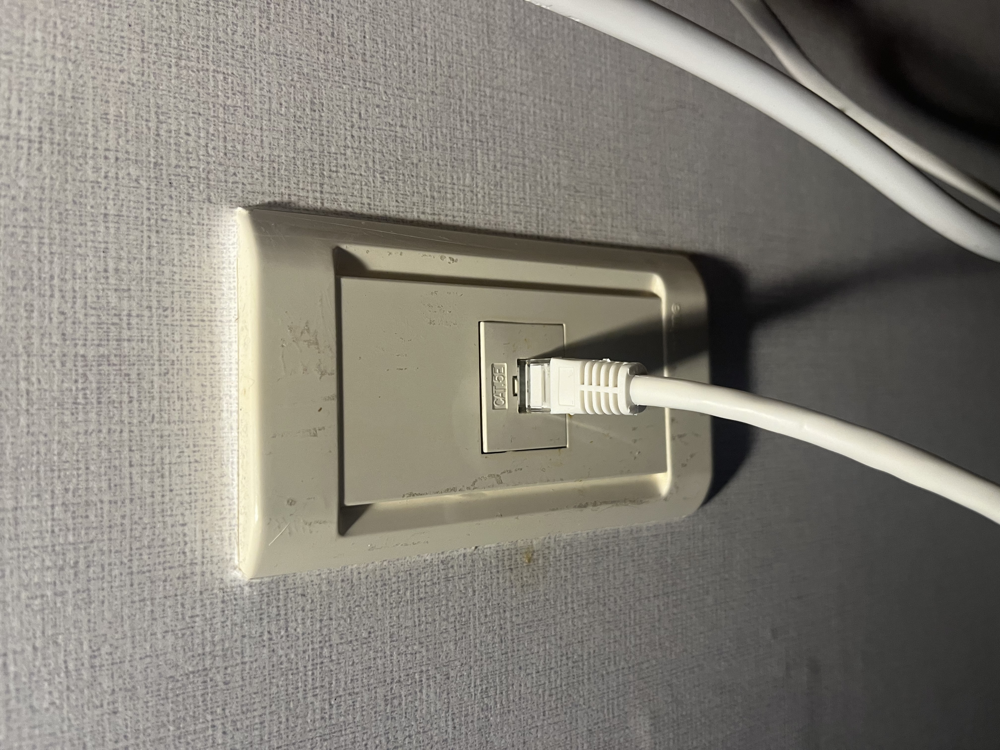
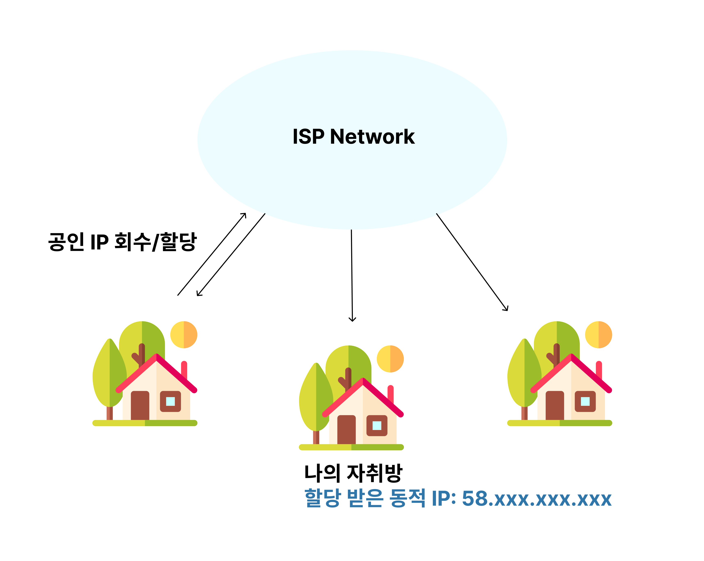
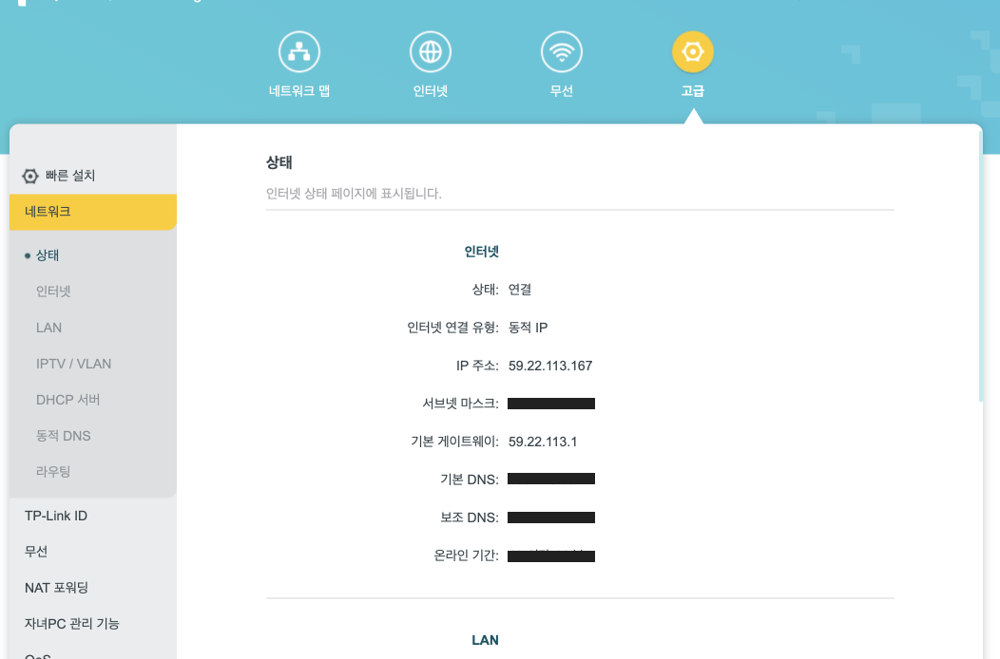
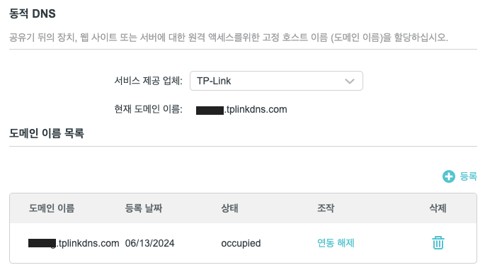
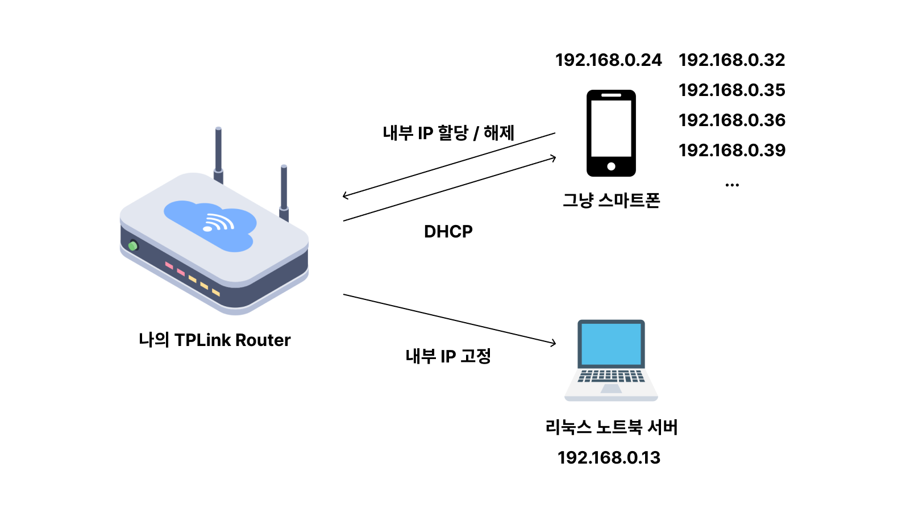
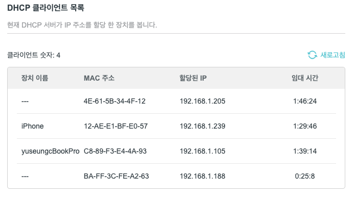
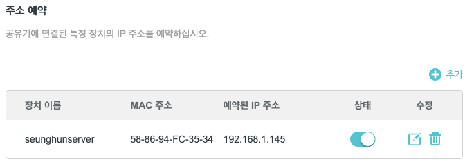
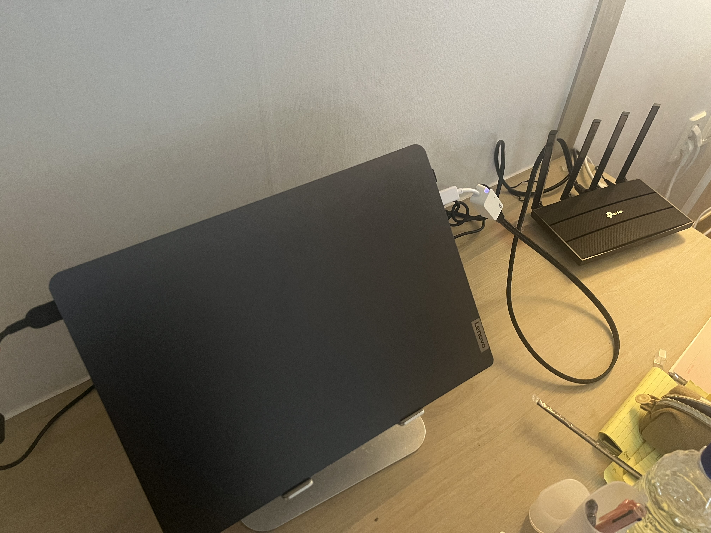

# 홈서버 네트워크 기초 구성하기

## 서론 

지난 포스팅에 이어서, 노트북에 우분투를 설치하였으니, 이를 **외부 접속이 가능한 서버**로 세팅을 해주어야 한다.

외부 접속을 위해선, 우리의 자취방에 하나씩은 있는 아래의 포트에 대한 이해가 필요하다.

<figure><figcaption>
자취방의 더러운 랜포트
</figcaption></figure>

이런 자취방에 있는 랜포트들은 원룸 건물주님께서 **ISP**(SKT, KT, LG U+)의 인터넷 서비스에 가입을 하여 인터넷이 제공되는 회선이다.

ISP 사의 네트워크 구성은 몰라도, 추상화 시키면 아래의 그림으로 표현할 수 있다.

<figure><figcaption>
추상화된 인터넷 할당 과정
</figcaption></figure>

ISP 사가 소유하고 있는 공인 IP(IPv4) 대역은 무한대는 아니다.

따라서 자원 효율성을 위해 유한 개의 공인 IP를 **풀링하듯이 각 인터넷 서비스 가입자들에게 할당/해제를 반복**한다.

그렇기 때문에 ISP가 제공하는 공인 IP라고 해서 웹서비스를 굴릴 수 있는 유일한 IP를 가지게 되는 것은 아니다. **언제든지 변경될 수 있기 때문이다.**

이 문제를 해결하고 가정집에서 외부에서 접근 가능한 유일한 주소를 가지고자, **DDNS**(Dynamic DNS)를 많이들 사용한다.

## 1. 라우터 상태 확인 

여하튼 내가 사용중인 라우터인 AX1500 Gigabit Wi-Fi 6 Router(TP-Link) 은 DDNS 서비스를 무료로 제공한다.

우선 세팅을 위해 192.168.0.1(TP Link Gateway)에 접속해보자

192.168.0.1은 제조사에서 설정해놓은 게이트웨이 주소이고, 이것은 제조사마다 상이할 수 있다.

~~아, 그리고 나는 게이트웨이 주소를 192.168.1.1로 변경해서 사용 중이다.~~

<figure><figcaption>
라우터 게이트웨이 기본 상태
</figcaption></figure>

위 처럼 58.xx 대역의 공인 IP가 할당되어 있는데, 그 위를 보면 동적 IP 라고 나와있는 것을 볼 수 있다.

서론에서 말했듯이, 언제든 변할 수 있다는 의미이다.

## 2. DDNS 설정 

DDNS 설정을 위해 위 사진에서의 동적 DNS 탭을 클릭하여 들어간다.

TP-Link 사의 DDNS 서비스를 무료로 이용하기 위해선 회원가입이 필요하며, 회원가입을 마치면 다음과 같은 화면이 나온다.

<figure><figcaption>
동적 DNS 설정
</figcaption></figure>

나는 이미 등록해놓은 상태라서 이런식으로 뜨지만,

우측 상단의 등록버튼을 누르면 tplinkdns.com의 서브 도메인을 지정하여 등록할 수 있다.

이로써 xxxx.tplinkdns.com으로 접속 시 DDNS 서비스가 자취방 라우터의 게이트웨이로 포워딩을 해줄 것이다!

\
3\. 노트북 서버에 내부 고정 IP 할당
-----------------------

<figure><figcaption></figcaption></figure>

대다수의 와이파이 공유기는 연결된 디바이스들에 내부 IP를 할당하여, 인터넷 서비스를 제공한다.

마치 **ISP가 자취방에 유동 공인 IP를 할당하듯이**, 자취방 내부 공유기도 디바이스에 같은 방식으로 유동 내부 IP를 일정 시간 임대해주고, 해제하는 방식으로 작동한다.

이 방식을 **DHCP**라고 하며, 새로운 디바이스(호스트)가 브로드캐스트로 DHCP 서버를 찾으면 이 서버는 새 IP 주소를 디바이스에 할당해준다.

<figure><figcaption>
내 라우터의 DHCP 클라이언트 리스트
</figcaption></figure>

하지만 서버로써 언제든지 외부에서 접근을 하기 위해서는, \
내부적으로도 고정된 주소가 있어야 외부 트래픽을 정상적으로 포워딩해줄 수 있다.

<figure><figcaption>
IP 주소 예약
</figcaption></figure>

그래서 위처럼 192.168.1.145를 내 노트북 서버에 고정을 시켜주었다.

## 4. NAT 포트포워딩 

자 이제 외부에서 게이트웨이로 접근할 수 있는 DNS 주소를 얻었고,

내부적으로도 노트북 서버의 주소를 192.168.1.145로 고정해주었다.

그렇다면 외부에서 접속이 필요할 때, 게이트웨이에서 노트북 서버의 특정 포트를 찾을 수 있어야 할 것이다.

그래서 NAT 포트포워딩이 필요하다.

<figure><figcaption>
트래픽 이동 과정
</figcaption></figure>

예를 들어, 내가 집 밖의 카페에서 내 노트북 서버의 SSHD 프로세스(22번 포트)로 접근하고 싶다면, xxxx.tplinkdns.com:22 로 접속하면 된다.

그러면 ddns 서비스에 의해 **A 레코드인 유동 공인 IP**를 찾고, **NAT에 의해 해당 유동 공인 IP는 로컬 내부 IP 주소를 찾게 될 것**이다.

그리고 최종적으로는 라우터에 설정되어 있는 포트포워딩 규칙에 따라 **특정 내부 IP의 특정 포트로 트래픽이 포워딩**된다.

<figure><figcaption>
포트포워딩 구성
</figcaption></figure>

나는 위처럼 192.168.1.145(내 노트북)에 대응되는 유동 IP의 특정 포트로 접속 시, 노트북 내의 특정포트로 찾아가는 형태로 구성하였다.

## 마치며 

<figure><figcaption>
완성된 노트북 서버
</figcaption></figure>

이로써 나는 어디서든 노트북에 접근할 수 있으며, 노트북을 서버처럼 이용할 수 있게되었다.

추가적으로, xxxx.tplinkdns.com 으로 매번 접속하기엔 손에 익지도 않고, 도메인 이름이 맘에 들지 않아서

가비아에서 나만의 도메인을 사서 CNAME 레코드에 xxxx.tplinkdns.com 주소를 매핑해주었다.

이제 해당 도메인을 이용해서 나만의 웹 서비스를 띄울 생각을 하니 벌써 심장이 뛴다…!!
